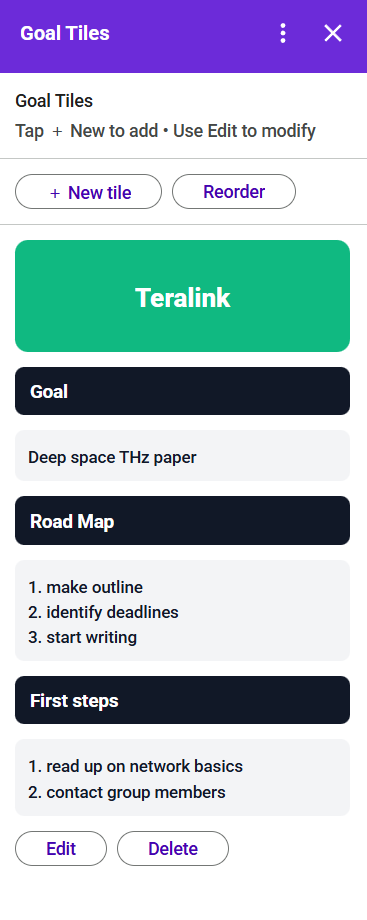

# Goal Tiles

A tile-based goal tracking system built as a Google Workspace (Google Calendar) Add-on.

Goal Tiles visualizes long-term and recurring goals as persistent, color-coded tiles instead of traditional task lists. Tiles are rendered using SVG for a clean sidebar UI and stored as JSON in Google Drive for persistence.

## Features
- Tile-based goal tracking UI optimized for Calendar sidebar
- Persistent storage via Google Drive (JSON)
- Reorderable tiles with caching/debounced writes
- Color picker + live banner preview
- SVG-based rendering (banners, section headers, multi-line text blocks)

## Tech Stack
- Google Apps Script (V8)
- Google Workspace Add-ons (CardService)
- Google Drive API (persistence)

## Notes
This repo contains the Apps Script source (`Code.gs`) and the add-on manifest (`appsscript.json`).

## Preview

